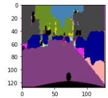
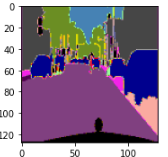

# Image Segmentation and Label Detection with FCN and ResNet50

## Project Overview
This project focuses on **image segmentation** using a Fully Convolutional Network (FCN) with **ResNet50** as the backbone for feature extraction. The objective is to detect various objects and segment them into distinct regions in an image. Additionally, the model includes a **label detection** functionality to recognize and categorize detected objects based on predefined labels.

## Key Features
- **FCN Architecture**: The model uses a Fully Convolutional Network for pixel-wise classification, ensuring each pixel in the image is assigned a specific label.
- **ResNet50 Backbone**: ResNet50 is used for efficient feature extraction, improving segmentation accuracy.
- **Label Detection**: After segmentation, the model detects the labels for each segmented region, classifying objects like cars, people, roads, buildings, etc.
- **Color-coded Mask Visualization**: Segmented masks are visualized with distinct colors for each class, helping to interpret the segmentation results.

## Dataset
The project uses the **Cityscapes** dataset, which contains urban street images annotated for pixel-level semantic segmentation. The dataset includes a wide range of object classes such as roads, sidewalks, cars, traffic signs, pedestrians, and buildings.

## Model Architecture

### Fully Convolutional Network (FCN)
- **Backbone**: ResNet50
- **Upsampling Layers**: FCN uses upsampling layers to predict segmentation maps at the same resolution as the input image.
- **Classification Layers**: A softmax layer is used for pixel-wise classification into one of the predefined labels.

### Label Detection
After segmentation, the model maps each pixel label to a corresponding human-readable class, such as:
- Unlabeled
- Road
- Sidewalk
- Building
- Car
- Traffic Light
- And more (refer to the `labels` dictionary in the code for all categories)

## Project Workflow

1. **Preprocessing**: Images are preprocessed to a fixed resolution (e.g., 128x128) and normalized.
2. **Training**: The model is trained using the Cityscapes dataset. The `ResNet50` backbone is pretrained on ImageNet and fine-tuned for the segmentation task.
3. **Label Prediction**: After segmentation, a post-processing step assigns labels to each pixel based on the model's predictions.
4. **Visualization**: The segmented masks are visualized using color coding for different classes. A label detection function maps the predicted segmentation into human-readable labels.
5. **Audio Feedback**: The detected labels are synthesized into speech using the Google Text-to-Speech (gTTS) library.

## Results

- **Pixel-wise Segmentation**: The model achieves fine-grained segmentation, distinguishing between multiple classes within urban scenes.
- **Label Detection**: Provides accurate categorization of detected objects in the scene, offering both visual and audio feedback.

### Example Output

#### Original Image:


#### Segmented Output:
)

#### Labels:
```text
road, sidewalk, building, car, pedestrian
```

## Future Improvements

- **Experiment with other backbones**: Try alternative feature extraction networks like VGG16 or EfficientNet to evaluate their impact on segmentation accuracy and speed.
- **Implement real-time segmentation**: Extend the model to support real-time segmentation and label detection using a webcam feed or live video input.
- **Explore multi-scale training**: Investigate multi-scale training techniques to improve the model's ability to handle object scale variations more effectively.


